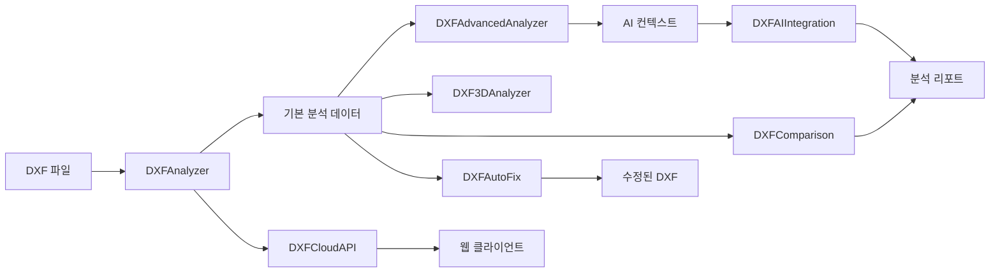

# DXF 분석기 v2.0 - 프로젝트 구조

## 📁 디렉토리 구조

```
dxf-analyzer-demo/
│
├── 🎯 핵심 모듈
│   ├── dxf_analyzer.py              # 메인 분석 엔진 (CLI 및 핵심 로직)
│   ├── dxf_analyzer_gui.py          # GUI 인터페이스 (Tkinter) (신규 분리)
│   ├── dxf_advanced_analyzer.py     # 고급 분석 (품질, 표준, 패턴)
│   └── dxf_analyzer_webapp.py       # Streamlit 웹 인터페이스
│
├── 🆕 v2.0 신규 모듈
│   ├── dxf_3d_analyzer.py           # 3D 엔티티 전문 분석
│   ├── dxf_comparison.py            # 도면 버전 비교
│   ├── dxf_auto_fix.py             # 자동 문제 수정
│   ├── dxf_cloud_api.py            # FastAPI 클라우드 서버
│   └── dxf_ai_integration.py       # OpenAI/Claude AI 통합
│
├── 🛠️ 유틸리티
│   ├── create_sample_dxf.py         # 테스트용 샘플 생성
│   ├── test_dxf_analyzer.py         # 단위 테스트
│   ├── test_v2_features.py          # v2.0 기능 테스트 (신규)
│   └── example_usage_v2.py          # 통합 사용 예시 (신규)
│
├── 📄 설정 파일
│   ├── requirements.txt             # Python 의존성 (v2.0 업데이트)
│   ├── setup.py                     # 패키지 설정
│   ├── Makefile                     # 빌드 자동화
│   ├── Dockerfile                   # Docker 컨테이너
│   └── docker-compose.yml           # Docker Compose 설정
│
├── 📚 문서
│   ├── README.md                    # 기본 설명서
│   ├── README_v2.md                 # v2.0 상세 설명서 (신규)
│   ├── PROJECT_STRUCTURE.md         # 이 문서 (신규)
│   └── LICENSE                      # MIT 라이선스
│
└── 🗂️ 생성 파일 (런타임)
    ├── *.dxf                        # DXF 파일들
    ├── *_report.md                  # 분석 리포트
    ├── *_ai_context.json            # AI 컨텍스트
    └── uploads/                     # API 업로드 (신규)
```

## 🔧 모듈별 기능

### 핵심 모듈

#### `dxf_analyzer.py`
- **클래스**: `DXFAnalyzer`
- **기능**: 
  - DXF 파일 파싱 및 핵심 분석 로직
  - 엔티티 분류, 통계 정보 생성
  - 마크다운 리포트 생성
  - CLI 인터페이스 및 다른 모듈(GUI, Web, API)에서 사용될 분석 엔진 제공
- **v2.0 업데이트**: 
  - 고급 분석 및 3D 분석 모듈과의 연동 강화

#### `dxf_analyzer_gui.py` (신규 분리)
- **클래스**: `DXFAnalyzerGUI`
- **기능**:
  - `dxf_analyzer.DXFAnalyzer`를 사용하는 Tkinter 기반 데스크톱 GUI 제공
  - 파일 열기, 분석 실행, 결과 표시, 리포트 저장 기능
  - v2.0 신규 기능(비교, 자동 수정, 3D/AI 분석) 연동 메뉴
- **참고**: 이전 `dxf_analyzer.py`에 포함되어 있던 GUI 로직이 분리됨

#### `dxf_advanced_analyzer.py`
- **클래스**: `DXFAdvancedAnalyzer`
- **기능**:
  - 도면 품질 평가 (A~F)
  - ISO/KS 표준 검증
  - 이상 징후 탐지
  - AI 컨텍스트 생성

### v2.0 신규 모듈

#### `dxf_3d_analyzer.py` 🆕
- **클래스**: `DXF3DAnalyzer`
- **기능**:
  - 3D 솔리드/서피스/메시 분석
  - Z축 범위 계산
  - 공간 복잡도 평가
  - 부피 추정

#### `dxf_comparison.py` 🆕
- **클래스**: `DXFComparison`
- **기능**:
  - 버전 간 차이 분석
  - 추가/제거/수정 추적
  - 변경 수준 평가
  - 비교 리포트 생성

#### `dxf_auto_fix.py` 🆕
- **클래스**: `DXFAutoFix`
- **기능**:
  - 표준 미준수 자동 수정
  - 중복 객체 제거
  - 레이어 구조 정리
  - 백업 생성

#### `dxf_cloud_api.py` 🆕
- **프레임워크**: FastAPI
- **엔드포인트**:
  - `/api/analyze` - 파일 분석
  - `/api/compare` - 파일 비교
  - `/api/autofix` - 자동 수정
  - `/api/status/{job_id}` - 작업 상태
- **기능**:
  - JWT 인증
  - 비동기 처리
  - Swagger 문서

#### `dxf_ai_integration.py` 🆕
- **클래스**: `DXFAIIntegration`
- **지원 AI**:
  - OpenAI GPT-4
  - Anthropic Claude 3
- **기능**:
  - 전문가 분석
  - 대화형 Q&A
  - 통합 인사이트

## 🔄 데이터 흐름



## 🚀 실행 방법

### 1. GUI 모드
```bash
python dxf_analyzer.py --gui
```

### 2. CLI 모드
```bash
python dxf_analyzer.py --cli sample.dxf -o report.md
```

### 3. 웹 모드
```bash
python dxf_analyzer.py --web
# 또는
streamlit run dxf_analyzer_webapp.py
```

### 4. API 서버
```bash
python dxf_cloud_api.py
# http://localhost:8000/docs
```

### 5. 통합 예시
```bash
python example_usage_v2.py
```

## 📦 의존성

### 필수
- `ezdxf>=1.1.0` - DXF 파싱
- `numpy>=1.21.0` - 수치 계산
- `python-dateutil>=2.8.0` - 날짜 처리

### GUI/웹 (선택)
- `tkinter` - GUI (기본 내장)
- `streamlit>=1.28.0` - 웹 인터페이스
- `pandas>=1.5.0` - 데이터 처리

### API 서버 (v2.0)
- `fastapi>=0.100.0` - API 프레임워크
- `uvicorn>=0.23.0` - ASGI 서버
- `pyjwt>=2.8.0` - JWT 인증
- `aiofiles>=23.0.0` - 비동기 파일 처리

### AI 통합 (v2.0)
- `openai>=1.0.0` - OpenAI API
- `anthropic>=0.3.0` - Claude API

## 🔐 환경 변수

```bash
# AI API 키
export OPENAI_API_KEY="sk-..."
export ANTHROPIC_API_KEY="sk-ant-..."

# API 서버
export SECRET_KEY="your-secret-key"
```

## 🧪 테스트

```bash
# 단위 테스트
python -m unittest test_dxf_analyzer.py

# v2.0 기능 테스트
python test_v2_features.py

# 통합 테스트
python example_usage_v2.py
```

## 📝 개발 가이드

### 새 분석기 추가
1. `dxf_custom_analyzer.py` 생성
2. 기본 인터페이스 구현
3. `dxf_analyzer.py`에 통합

### AI 프롬프트 커스터마이징
```python
ai = DXFAIIntegration()
ai.prompts['custom'] = "Your custom prompt..."
```

### API 엔드포인트 추가
```python
@app.post("/api/custom")
async def custom_endpoint():
    # 구현
    pass
```

## 🎯 버전 히스토리

### v1.0.0 (초기 버전)
- 기본 DXF 분석
- GUI/CLI/Web 인터페이스
- 고급 분석 (품질, 표준)

### v2.0.0 (현재)
- ✨ 3D 엔티티 분석
- ✨ 도면 버전 비교
- ✨ 자동 문제 수정
- ✨ 클라우드 API 서버
- ✨ AI 통합 (GPT-4, Claude)
- 🔧 GUI 메뉴 확장
- 📚 통합 예시 추가

---

**DXF Analyzer v2.0** - 전문가급 CAD 도면 분석 솔루션 🚀 

## 📁 주요 모듈 (v2.1 업데이트)

### 🏭 CNC 특화 모듈 (신규)

#### `dxf_cnc_analyzer.py`
CNC 가공성 분석 전문 모듈
- **MachinabilityScore**: 가공성 점수 데이터 클래스
- **ToolRecommendation**: 공구 추천 정보
- **DXFCNCAnalyzer**: CNC 분석 메인 클래스
  - `analyze_machinability()`: 종합 가공성 분석
  - `_recommend_tools()`: 최적 공구 추천
  - `_estimate_machining_time()`: 가공 시간 예측
  - `_analyze_toolpath_optimization()`: 공구 경로 최적화

#### `dxf_cost_estimator.py`
제조 비용 예측 모듈
- **MaterialCost**: 재료비 계산
- **MachiningCost**: 가공비 계산
- **ToolingCost**: 공구비 계산
- **DXFCostEstimator**: 비용 예측 메인 클래스
  - `estimate_total_cost()`: 총 비용 예측
  - `_calculate_material_cost()`: 재료비 상세 계산
  - `_apply_quantity_discount()`: 수량 할인 적용
  - `export_quotation()`: 견적서 생성

#### `dxf_business_dashboard.py`
경영진용 비즈니스 대시보드
- **BusinessDashboard**: Streamlit 기반 대시보드
  - `_render_overview_dashboard()`: 종합 대시보드
  - `_render_cost_analysis()`: 비용 분석 페이지
  - `_render_productivity_analysis()`: 생산성 분석
  - `_render_quality_trends()`: 품질 트렌드
  - `_render_ai_insights()`: AI 인사이트
  - `_render_project_management()`: 프로젝트 관리

### 🤖 AI 통합 모듈 (v2.1 업데이트)

#### `dxf_ai_integration.py`
AI 모델 통합 (OpenAI, Claude, Gemini)
- **DXFAIIntegration**: AI 통합 클래스
  - `analyze_with_openai()`: GPT-4 분석
  - `analyze_with_claude()`: Claude 분석
  - `analyze_with_gemini()`: Gemini 분석 (신규)
  - `analyze_with_all()`: 모든 AI 모델 통합 분석
  - CNC 특화 프롬프트 추가
  - 비용 예측 프롬프트 추가

## 🔧 환경 설정 (v2.1)

### 필수 환경 변수
```bash
# AI API 키
export OPENAI_API_KEY="your-key"
export ANTHROPIC_API_KEY="your-key"
export GOOGLE_API_KEY="your-key"  # Gemini용

# 서버 설정
export JWT_SECRET_KEY="your-secret-key"
export UPLOAD_DIR="./uploads"
```

### 추가 의존성
```bash
# AI/ML
google-generativeai>=0.3.0

# 데이터 시각화
plotly>=5.17.0
matplotlib>=3.7.0

# 비즈니스 대시보드
streamlit>=1.28.0
pandas>=2.0.0
```

## 🚀 고급 사용 예제

### CNC 통합 분석
```python
# CNC 가공성 + 비용 예측 통합
from dxf_cnc_analyzer import DXFCNCAnalyzer
from dxf_cost_estimator import DXFCostEstimator

# CNC 분석
cnc = DXFCNCAnalyzer()
machinability = cnc.analyze_machinability("part.dxf", "aluminum")

# 비용 예측
estimator = DXFCostEstimator()
cost = estimator.estimate_total_cost(
    "part.dxf",
    {'type': 'aluminum', 'grade': '6061'},
    production_qty=100
)

# 통합 리포트 생성
print(cnc.generate_cnc_report(machinability))
print(estimator.generate_cost_report(cost))
```

### 비즈니스 대시보드 실행
```bash
# 대시보드 서버 시작
streamlit run dxf_business_dashboard.py

# 브라우저에서 http://localhost:8501 접속
```

## 📊 데이터 플로우

```
DXF 파일
   ↓
[기본 분석] → [고급 분석] → [CNC 분석]
   ↓              ↓              ↓
[AI 통합] ← [비용 예측] ← [품질 평가]
   ↓
[비즈니스 대시보드]
   ↓
경영진 인사이트 / CAD 전문가 리포트
``` 